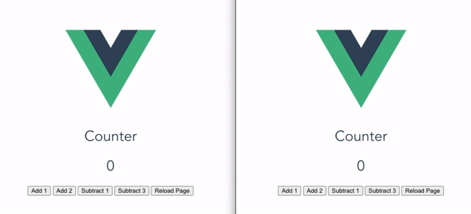

# Vuex CrossTab

> CrossTab syncs Vuex state across same-origin tabs

Inspired by [storeon/crosstab](https://github.com/storeon/crosstab).

## Demo



They way it works is that it tracks your mutations and replays them in other open tabs on the same domain origin.

## Installation

* `npm install --save vuex-crosstab`

```js
// es6
// import CrossTab from 'vuex-crosstab';
// commonjs
const CrossTab = require('vuex-crosstab');

export default new Vuex.Store({
  // ...
  plugins: [
    // your other plugins...
    CrossTab({ recover: true })
  ],
  // ...
});
```

## Options

* `config.key`: the storage key to use. default = `"vuex-crosstab"`
* `config.recover`: if old state should be recovered on load. default = false
* `config.filter`: a filter function for ignoring events. default = null

## License

[LICENSE](LICENSE)
